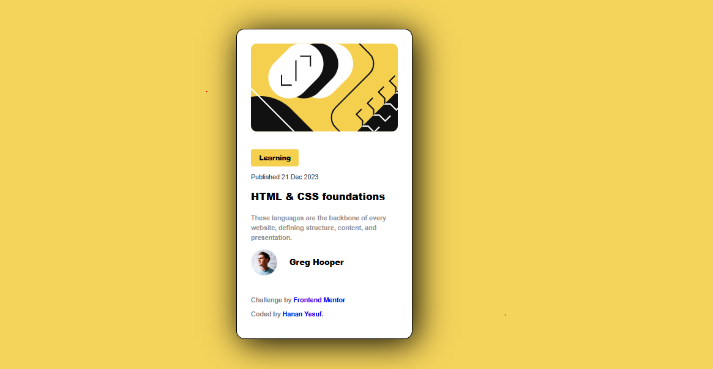

# Frontend Mentor - Blog Preview Card Solution

This is a solution to the [Blog preview card challenge on Frontend Mentor](https://www.frontendmentor.io/challenges/blog-preview-card-component-2OZKbK8l6). Frontend Mentor challenges help you improve your coding skills by building realistic projects.

## Table of Contents

- [Overview](#overview)
  - [The preview](./preview.jpg)
  - [Screenshot](./assets/images/screanshot.PNG)
  - [Links](https://github.com/hanan267/Blog-preview-card))


## Overview

### The Challenge

Users should be able to:

- See hover and focus states for all interactive elements on the page

### preview


### Screenshot




### Links

- Solution URL: [Add your solution URL here](https://github.com/hanan267/Blog-preview-card.git)
- Live Site URL: [Add your live site URL here](https://your-live-site-url.com)

## My Process

### Built With

- Semantic HTML5 markup
- CSS custom properties
- Flexbox
- CSS Grid
- Mobile-first workflow

### What I Learned

Use this section to recap over some of your major learnings while working on this project. You can include code snippets, links to resources, or any other information that you found particularly helpful.

```html
<!-- Example code -->
<div class="example">
  <p>Example code snippet</p>
</div>iles)
# Blog-card-preview
